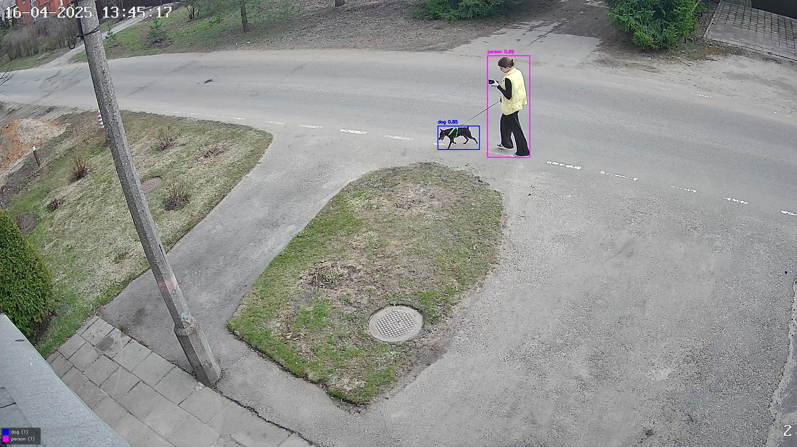
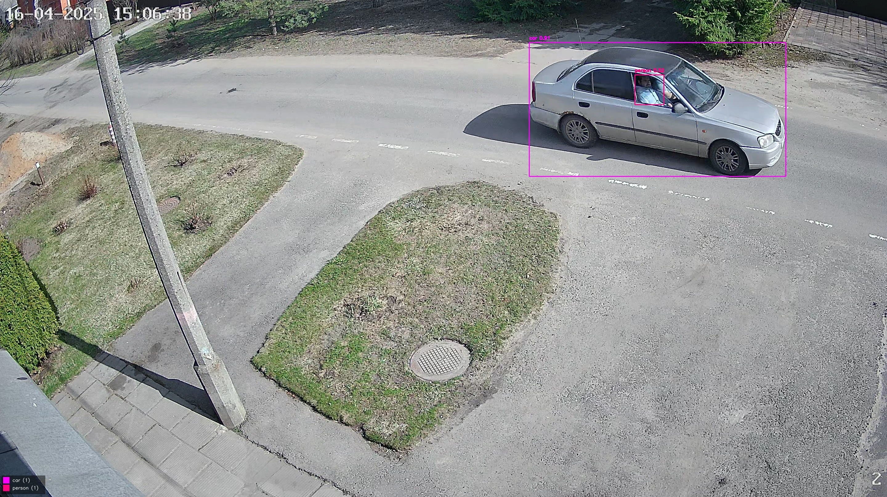
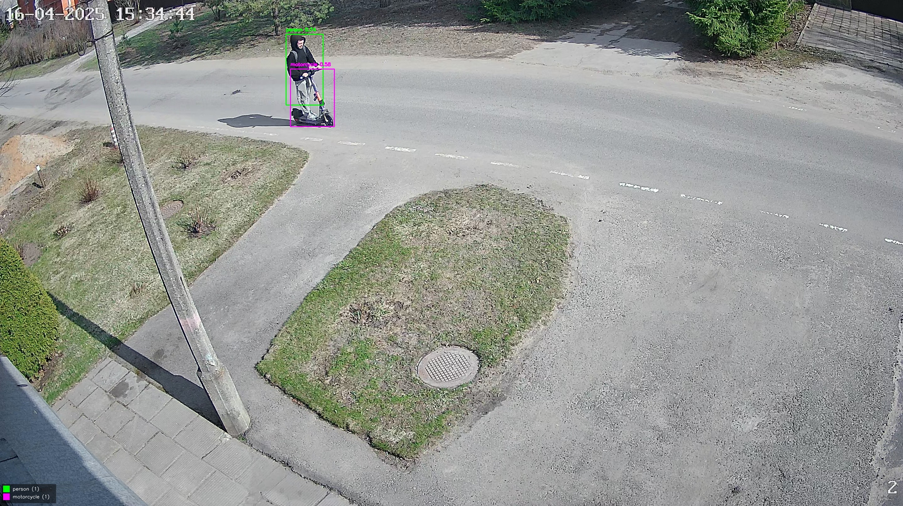
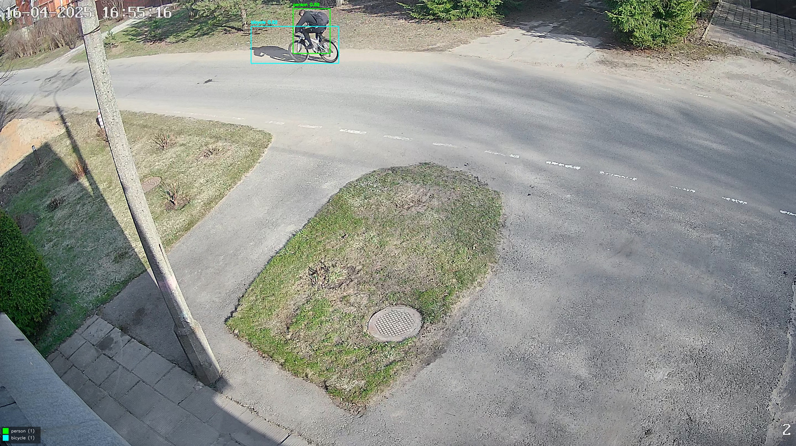
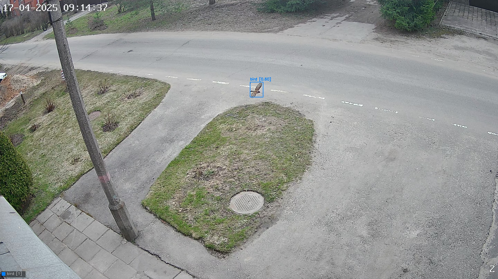
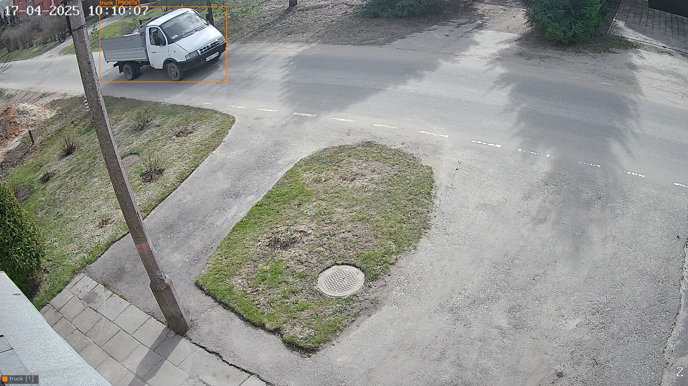
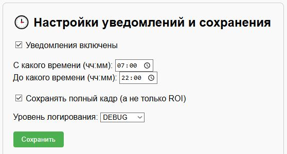

# 🚨 YOLO_Cam_Detector

Проект видеомониторинга с использованием детектора объектов YOLOv8. Распознаёт людей, животных и автомобильные номера в режиме реального времени, отправляет email-уведомления и сохраняет логи с изображениями.

## 🔧 Возможности

- 🎥 Подключение к камере или видеопотоку
- 📦 Обнаружение объектов (люди, животные, авто)
- 🔢 Распознавание автомобильных номеров
- 📨 Email-уведомления в заданное время
- 🧠 Настраиваемый веб-интерфейс на FastAPI
- 📁 Сохранение логов и изображений
- 🎨 Цветовая палитра по классам
- 🔄 Автоматический перезапуск при ошибках

## 📸 Примеры работы

 
 
 

## ⚙️ Установка

```bash
git clone https://github.com/i-koskin/YOLO_Cam_Detector.git
cd YOLO_Cam_Detector
python -m venv venv
venv\Scripts\activate  # Windows
pip install -r requirements.txt
```
## 🛠️ Интерфейс конфигурации

```bash
uvicorn web_interface:app --reload --port 8000
```


## 🚀 Запуск

```bash
python main.py
```

## 📁 Структура

- `logs/images/` — сохранённые кадры
- `logs/YYYY-MM-DD_log.log` — журнал работы системы
- `docs/` — скриншоты работы системы
